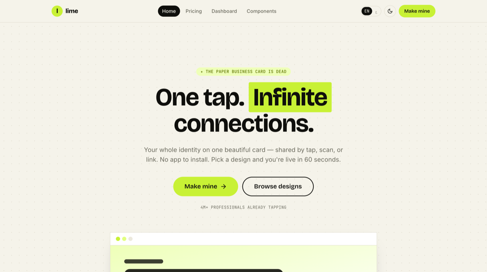
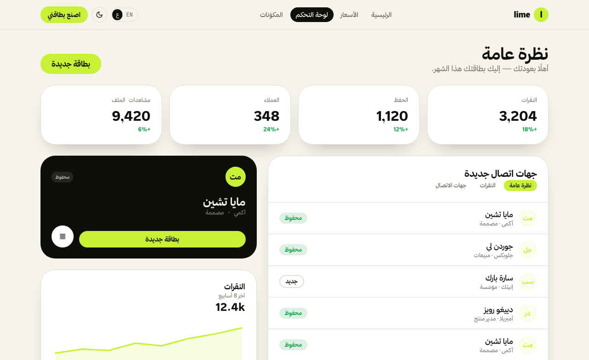
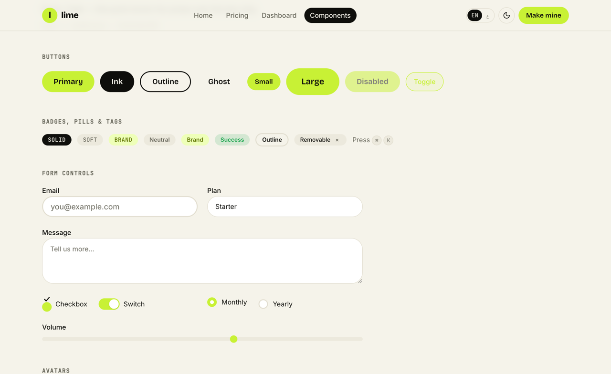

# Lime — limey digital-card UI kit

A limey product kit: warm **cream + near-black ink + a vivid acid-lime** accent.
Heavy Hanken Grotesk display, monospace micro-labels, highlight-marker headings,
a marquee and dark bento sections. Light + dark, full **EN/AR + RTL**. A runnable
React app you clone and build your product from — a digital business card, by default.

[](https://uikit.studio/kit/lime)
[](https://www.npmjs.com/package/uikit-studio)




**[▶ Open the live demo →](https://uikit.studio/demos/lime/)** &nbsp;·&nbsp;
**[Gallery page →](https://uikit.studio/kit/lime)**

## Quick start

```bash
git clone https://github.com/kernelcode/lime-uikit my-app
cd my-app/react
pnpm install && pnpm dev          # → a real app at localhost:5173
```

Then open in Claude Code and ask: *"build a digital business card page using this kit."*
The bundled skill (`.claude/skills/lime`) makes the AI build **with** the kit's
tokens and components.

## Design system

| | |
|---|---|
| **Primary** | `#c8f135` (acid lime) |
| **Mark** | `#c8f135` (highlight) |
| **Background** | `#f5f3ea` cream · `#0e0e0b` ink (dark) |
| **Display** | Bricolage Grotesque (EN) · Thmanyah Sans (AR) |
| **Body** | Inter (EN) · Thmanyah Sans (AR) |
| **Mono** | JetBrains Mono |
| **Radius** | 1.5rem cards · 2rem sections · pill buttons |
| **Modes** | light + dark |
| **Responsive** | mobile → tablet → desktop (Tailwind `sm`/`md`/`lg`/`xl`) |
| **i18n** | EN + AR with full RTL |

**Components** — Button · Card · Input · Badge · Pill · Mark · Marquee · Container
**Blocks** — Navbar · Footer · StatCards
**Pages** — Landing · Pricing · Dashboard · Components showcase

Tokens live in [`design/`](./design) (`tokens.json` → `theme.css` v4 +
`tailwind-preset.js` v3). The manifest is [`uikit.json`](./uikit.json).

## Screenshots

| Dashboard | Components showcase |
|---|---|
|  |  |

## Add pieces to an existing project

```bash
npx uikit-studio add landing       # a full template + every component it needs
npx uikit-studio add button card   # just the components you want
```

See **[USAGE.md](./USAGE.md)** for the full consumer guide.

## Use this design with an AI agent 🤖

This kit is **agent-ready**. Point Claude Code / Cursor / Codex at it and it reproduces
the exact design — tokens, fonts, rounded radius, components. Paste:

> Build me a website styled exactly like this design: https://uikit.studio/kit/lime —
> it's agent-ready. Read the spec at https://uikit.studio/kit/lime/llms.txt and match
> its color tokens (light + dark), fonts, radius and components.

- **Agent spec:** <https://uikit.studio/kit/lime/llms.txt> · manifest
  <https://uikit.studio/kit/lime/manifest.json>
- Or point the agent **at this repo** — it reads [`AGENTS.md`](./AGENTS.md) + [`llms.txt`](./llms.txt).

---

MIT © [kernelcode](https://github.com/kernelcode) · a community kit in the
[uikit.studio](https://uikit.studio) gallery
